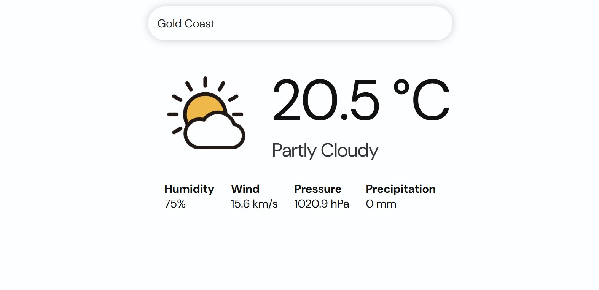
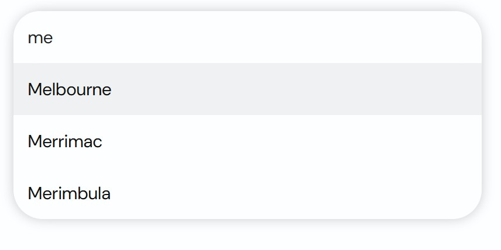

# Weather Web App

A simple React web app for displaying the current weather of Australian cities. 
Weather data is retrieved from a free weather REST API, and an image is displayed based on the weather code returned.



Australian cities are searchable using a search bar that updates with suggestions every time the user presses a key.



## Getting Started

This is a [Next.js](https://nextjs.org) project bootstrapped with [`create-next-app`](https://nextjs.org/docs/app/api-reference/cli/create-next-app).

First, run the development server:

```bash
npm run dev
# or
yarn dev
# or
pnpm dev
# or
bun dev
```

Open [http://localhost:3000](http://localhost:3000) with your browser to see the result.

You can start editing the page by modifying `app/page.js`. The page auto-updates as you edit the file.

This project uses [`next/font`](https://nextjs.org/docs/app/building-your-application/optimizing/fonts) to automatically optimize and load [Geist](https://vercel.com/font), a new font family for Vercel.

## Assets and Resources

[Open Mentro](https://open-meteo.com/) - Weather API \
[Simple Maps](https://simplemaps.com/data/au-cities) - Australian Cities CSV containing longitude and latitude \
[Icon Finder](https://www.iconfinder.com/weather-icons?price=free) - Weather icons \
[Font Awesome](https://fontawesome.com/) - Loading icon
